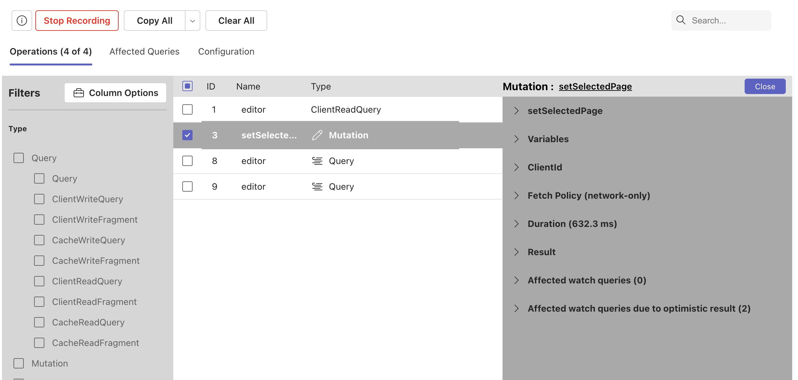

# Operations Tracker

Records all operations being executed via Apollo client in a given time and shows info about each operation.
This UI is using [apollo-inspector](https://www.npmjs.com/package/apollo-inspector?activeTab=readme) library 

## What kind of issues can be debugged using the tool

- Helps figuring out `unwanted operations` being fired in render phase
- Help in figuring out the reasons for `multiple re-renders` of the same watch query​
- Help figuring out issues with `conflicting queries​`
- Shows field name in case `missing field error`
- Detailed time info lets you figure out if queries are being fired in `Waterfall model` or not.
- Helps figuring out if `data is taking too much time` to get written to cache.
- Shows why an operation failed

## Built in features

- Tracks all operations Query, Mutation, subscription, client.readQuery, client.writeQuery, cache.readQuery, cache.writeQuery, client.readFragment, client.writeFragment, cache.readFragment, cache.writeFragment.
- For each operations, below info is available
  - Operation Name
  - Operation Type
  - Failure or Succeded
  - Fetch policy
  - Total execution time
  - Operation queued at time
  - Size in KB of the result of the Operation
- There are filters present using which, one can filter operations list
  - Operation type filter (Query/Mutation/Subscription)
  - Results from filter (Cache/Network)
  - Operation Status (Succeeded/Failed)
- It also shows which all operations are responsible for re-rendering of an query in `Affected Queries` view
- It allows you copy operations data in JSON format.

## How to use

1. Select the apollo clients which needs to be tracked
   

2. Click on Record button
3. Do some changes in UI.
4. It'd start showing all the on-going operations.

 5. Click on a operation to see detailed view

6. One can select operation to copy by checking the checkboxes for each operation.

## Filter options

- Supports comma separate search text to search multiple operations
- Filter by Operation type (Query/Mutation/Subscription)
- Filter by from where the result is being fetched (Cache/Network)
- Filter by operation status (Succeded/Failed)

## Copy options

### Copy All Operations

It copies all the operations which have been recorded

### Copy Filtered Operations

It copies only the current view of the operations

### Copy Checked Operations

It copies only those operations, whose check boxes are checked

### Copy currently Opened Operation

It copies the operation, which is currently opened in the detailed view

## Affected Queries view

This view shows what operations led to re-render of a given query.
On the left side is the list of queries which have been re-rendered and on the right side, it shows what all operation caused it.

# Demo

Run `yarn parcel:test:start` to see the demo the tool working
